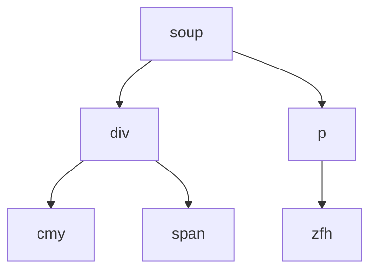

# BeautifulSoup4笔记


**本文的内容总结自[BeautifulSoup4官方文档](https://beautifulsoup.readthedocs.io/zh_CN/v4.4.0/#id7)**


## <font color=orange>练习对象</font>

为了练习beautifulsoup，使用官方文档推荐的`Alice`文段来进行练习

```html
html_doc = """
<html><head><title>The Dormouse's story</title></head>
<body>
<p class="title"><b>The Dormouse's story</b></p>

<p class="story">Once upon a time there were three little sisters; and their names were
<a href="http://example.com/elsie" class="sister brother" id="link1">Elsie</a>,
<a href="http://example.com/lacie" class="sister" id="link2">Lacie</a> and
<a href="http://example.com/tillie" class="sister" id="link3">Tillie</a>;
and they lived at the bottom of a well.</p>

<p class="story">...</p>
"""
```

使用如下方法进行解析

```python
from bs4 import BeautifulSoup
soup = BeautifulSoup(html_doc, 'html.parser')
print(soup.prettify())
```

注意，进行解析后，文档变成了**`Unicode`**格式

使用`.prettify()`方法会打印如下标准缩进形式的代码

```html
<html>
<head>
    <title>
        The Dormouse's story
    </title>
</head>
<body>
    <p class="title">
        <b>
            The Dormouse's story
        </b>
    </p>
    <p class="story">
        Once upon a time there were three little sisters; and their names were
        <a class="sister brother" href="http://example.com/elsie" id="link1">
            Elsie
        </a>
        ,
        <a class="sister" href="http://example.com/lacie" id="link2">
            Lacie
        </a>
        and
        <a class="sister" href="http://example.com/tillie" id="link2">
            Tillie
        </a>
        ; and they lived at the bottom of a well.
    </p>
    <p class="story">
        ...
    </p>
</body>
</html>
```

## <font color=orange>四种对象</font>

Beautiful Soup将复杂HTML文档转换成一<font bgcolor=orange></font>个复杂的树形结构,每个节点都是Python对象,所有对象可以归纳为4种: `Tag` , `NavigableString` , `BeautifulSoup` , `Comment` 

### Tag

tag是原HTML代码中的标签

对于代码<font color=orange>`<p class=’abc def’>`</font>123 <font color=orange>`</p>`</font>来说，tag指的是橙色部分的内容

但需要注意的是，tag包含标签以及标签中的字符串以及其它标签，可以用`.string`或者`.text`方法获得标签中的`NavigableString`对象

**bs提供了多种方法可以遍历这些节点，诸如`.head`等。但是`NavigableString`对象没有子节点，因此不能用这些方法**

#### ,name

对于已经拿到的tag对象来说，想要知道它是什么类型的对象就使用.name

```python
print(soup.a.name)

# a
```

这个语句实际上会查询的是`<a href="http://example.com/elsie" class="sister brother" id="link1">Elsie</a>`这个a标签的名字也就是a

用这个作为例子有些愚蠢，我选择了a标签那表明我已经知道这是个a标签了。这个可以用来查看不清楚的对象的名字

#### .attrs

查看对象的属性，也就是标签中的属性和他们的值

```python
print(soup.a.attrs)

# {'href': 'http://example.com/elsie', 'class': ['sister', 'brother'], 'id': 'link1'}
```

这个语句实际上会查询的是`<a href="http://example.com/elsie" class="sister brother" id="link1">Elsie</a>`这个a标签的属性的名称和它们的值。需要注意的是如果**一个属性可能会对应多个值**，那么就会以数组的形式返回数值。如果这个class只有一个值，也会以数组的形式返回这一个值

#### .string 与 .text

获取标签中字符串的值。需要注意的是`.string`返回的字符串的类型是`NavigableString`，而.text返回的是字符型。虽然这两种在使用上没有任何区别，但是`NavigableString`类型附带有地址信息，会占用内存

```python
print(type(soup.a.string))
print(type(soup.a.text))

# <class 'bs4.element.NavigableString'>
# <class 'str'>
```

### NavigableString

指的是标签中的字符串，也就是tag中的字符串.获取标签中的字符串的方法是用上文提到的`.string`方法和`.text`方法

### BeautifulSoup

该对象指的是由整个网页生成的`soup`对象

```python
soup = BeautifulSoup(html_doc, 'html.parser')
```

它的name属性是`document`

```python
print(soup.name)

# <class 'bs4.element.NavigableString'>[document]
```

### Comment

它是特殊类型的`NavigableString`对象。指的是HTML代码中的注释部分

## bs如何进行解析

对于如下一段简单的代码

```html
<div>
    cmy
    <span></span>
</div>
<p>zfh</p>
```

解析成的文件树如下所示



需要注意的是，如果一个标签中没有内容（如上图的span标签），那么用`.string`获取内容时会返回`None`


## <font color=orange>从一个对象找到其他对象的方法</font>

### .(点)

使用.从soup也就是处理完成后得到的文件树的树根开始抵达下一个标签

使用点的方法只能获得当前名字的第一个tag

注意其在寻找时采取<font color=red>**广度优先**</font>的搜索方法，如下情况时搜索b标签会返回`<b>abc</b>`

```html
<p class="title"><h4><b>abc</b></h4>></p>
<p class="title"><b>def</b></p>
```


## <font color=orange>搜索对象的方法</font>

### get_text()

得到标签中包含的全部文字内容。注意，得到的内容也包含标签中子孙标签的内容。

```python
print(soup.body.get_text())

# The Dormouse's story
# Once upon a time there were three little sisters; and their names were
# Elsie,
# Lacie and
# Tillie;
# and they lived at the bottom of a well.
# ...
# """
```

### find()

当我们只想找到一个标签，然后再继续在这个标签的基础上使用各种方法的时候，使用`find_all`的话会找到多个符合要求的结果，这时候想要选中第一个还需要指定是第一个元素`soup.find_all('p')[0].string`。所以使用`find()`来进行寻找。使用方法如`find_all()`

### CSS选择器


### find_all()

`find_all()` 方法搜索当前tag的所有tag子节点，并判断是否符合过滤器的条件。符合条件的结果将会以数组的形式返回（需要注意的是，返回的元素的格式仍然是`Tag`对象）。过滤器就指的是括号中设置的参数。参数有**name , attrs , recursive , string , keyword**这五种

**注意，括号中可以同时存在这五种参数中的若干种**

#### name

`a` 参数可以查找所有名字为 `a` 的**标签（包括内容）**

```python
print(soup.find_all('a'))

# [<a class="sister brother" href="http://example.com/elsie" id="link1">Elsie</a>, <a class="sister" href="http://example.com/lacie" id="link2">Lacie</a>, <a class="sister" href="http://example.com/tillie" id="link3">Tillie</a>]
```

#### attrs

按照**标签中的属性**搜索，返回**标签（包括内容）**。也就是根据CSS搜索。注意在搜索`class`属性的时候要加`_`

```python
print(soup.find_all("a", class_="sister"))

# [<a class="sister brother" href="http://example.com/elsie" id="link1">Elsie</a>, <a class="sister" href="http://example.com/lacie" id="link2">Lacie</a>, <a class="sister" href="http://example.com/tillie" id="link3">Tillie</a>]
```

<font color=red>如果某个属性在搜索时不能使用，还可以**自定义参数**</font>

```python
print(soup.find_all(attrs={"id": "link1"}))

# [<a class="sister brother" href="http://example.com/elsie" id="link1">Elsie</a>]
```


#### `recursive`

调用tag的 `find_all()` 方法时,Beautiful Soup会检索**当前tag的所有子孙节点**,如果只想搜索tag的直接子节点,可以使用参数 `recursive=False`。这个参数只能添加在搜索`Tag`对象的时候。因为`NavigableString`对象没有子节点

文档片段

```html
<div>zfh<p class="abc">cmy</p>hxy</div>
<p class="abc">jsk</p>
```

添加`recursive=False`参数后的结果

```python
print(soup.find_all("p", class_='abc', recursive=False))

# [<p class="abc">jsk</p>]
```

没有添加`recursive=False`参数后的结果

```python
print(soup.find_all("p", class_='abc'))

# [<p class="abc">cmy</p>, <p class="abc">jsk</p>]
```

#### string

通过 `string` 参数可以搜索文档中的<font color=red>**字符串内容**</font>，返回**标签中的内容**，也就是说它只匹配；两个标签中的正文内容，也就是`NavigableString`对象

string参数的可选数值包括**字符串，正则表达式，列表，True**

##### 字符串

注意，这里只能输入<font color=red>**完整字符串**</font>才能找到对应的内容，否则应该用下面的正则表达式

```python
print(soup.find_all(string="The Dormouse's story"))
print(soup.find_all(string=["Tillie", "Elsie", "Lacie"]))

# ["The Dormouse's story", "The Dormouse's story"]
# ["Elsie", "Lacie", "Tillie"]
```

这看起来非常愚蠢，但是可以用于多个条件过滤时其中一个过滤条件。

##### 正则表达式

```python
print(soup.find_all(string=re.compile("Dormouse")))

# ["The Dormouse's story", "The Dormouse's story"]
```

##### 列表

如果传入列表参数，bs会将与列表中任一元素匹配的内容返回

请注意，**列表中只能放标签名**

```python
print(soup.find_all(["a", "b"]))

# [<b>The Dormouse's story</b>, <a class="sister brother" href="http://example.com/elsie" id="link1">Elsie</a>, <a class="sister" href="http://example.com/lacie" id="link2">Lacie</a>, <a class="sister" href="http://example.com/tillie" id="link3">Tillie</a>]
```

##### True

返回该HTML文件的全部内容

```python
for i in soup.find_all(True):
    print(i.name)
    
# html
# head
# title
# body
# p
# b
# p
# a
# a
# a
# p
```

#### keyword

如果制定了一个参数，而这个参数不属于上述四种参数，那么搜索时会把该参数当作指定名字tag的属性来搜索

例如，如果包含一个名字为 `id` 的参数。bs会搜索每个tag的`id`属性。如果设置`id=True`，那么就会返回全部带有id的标签和内容。

```python
print(soup.find_all(href=re.compile("elsie")))
print(soup.find_all(class_ = ['sister','brother']))
print(soup.find_all(id = True))

# [<a class="sister brother" href="http://example.com/elsie" id="link1">Elsie</a>]
# [<a class="sister brother" href="http://example.com/elsie" id="link1">Elsie</a>, <a class="sister" href="http://example.com/lacie" id="link2">Lacie</a>, <a class="sister" href="http://example.com/tillie" id="link3">Tillie</a>]
# [<a class="sister brother" href="http://example.com/elsie" id="link1">Elsie</a>, <a class="sister" href="http://example.com/lacie" id="link2">Lacie</a>, <a class="sister" href="http://example.com/tillie" id="link3">Tillie</a>]

```

#### 小结

在该函数中灵活使用以上的一种或者**数种**过滤器以便更好的实现搜索。之前我以为只能选择其中的一种进行过滤因而掉坑。以及以上参数有的会返回标签和内容，有的会只返回内容，需要注意的是如果返回标签和内容的参数和只返回内容的参数一起用那么会返回标签加内容

```python
print(soup.find_all(attrs={"id": "link1"},string='Elsie'))

# [<a class="sister brother" href="http://example.com/elsie" id="link1">Elsie</a>]
```


## 只解析部分文档

如果明确只需要某标签内的内容，那么就不需要解析全部文档以节省时间


## 报错可能若干原因

- `UnicodeEncodeError: 'charmap' codec can't encode character u'\xfoo' in position bar` (或其它类型的 `UnicodeEncodeError` )的错误,主要是两方面的错误(都不是Beautiful Soup的原因),第一种是正在使用的终端(console)无法显示部分Unicode,参考 [Python wiki](http://wiki.python.org/moin/PrintFails) ,第二种是向文件写入时,被写入文件不支持部分Unicode,这时只要用 `u.encode("utf8")` 方法将编码转换为UTF-8.
- `KeyError: [attr]` 因为调用 `tag['attr']` 方法而引起,因为这个tag没有定义该属性.出错最多的是 `KeyError: 'href'` 和 `KeyError: 'class'` .如果不确定某个属性是否存在时,用 `tag.get('attr')` 方法去获取它,跟获取Python字典的key一样
- `AttributeError: 'ResultSet' object has no attribute 'foo'` 错误通常是因为把 `find_all()` 的返回结果当作一个tag或文本节点使用,实际上返回结果是一个列表或 `ResultSet` 对象的字符串,需要对结果进行循环才能得到每个节点的 `.foo` 属性.或者使用 `find()` 方法仅获取到一个节点
- `AttributeError: 'NoneType' object has no attribute 'foo'` 这个错误通常是在调用了 `find()` 方法后直节点取某个属性 .foo 但是 `find()` 方法并没有找到任何结果,所以它的返回值是 `None` .需要找出为什么 `find()` 的返回值是 `None` .

总的来说需要注意使用`find`返回的东西的类型是`tag`，可以继续使用`tag`相关的各种方法。但是`find_all`返回的则是列表，所以不能继续用相关方法，在f`ind_all`后使用各种方法大抵是各种错误的根源

```python
print(type(soup.find_all(id="link1")))
print(type(soup.find(id="link1")))

# <class 'bs4.element.ResultSet'>
# <class 'bs4.element.Tag'>
```


# 总结

之前在word上对相关用法进行了总结，以应付毕设，现在想要重新学习和牢固掌握爬虫方法因而结合实际使用经验和中文文档重新学习，结果发现整理出来的笔记内容也就和官方文档差不多，只是删掉了用得少的部分，感觉好像是在浪费时间。